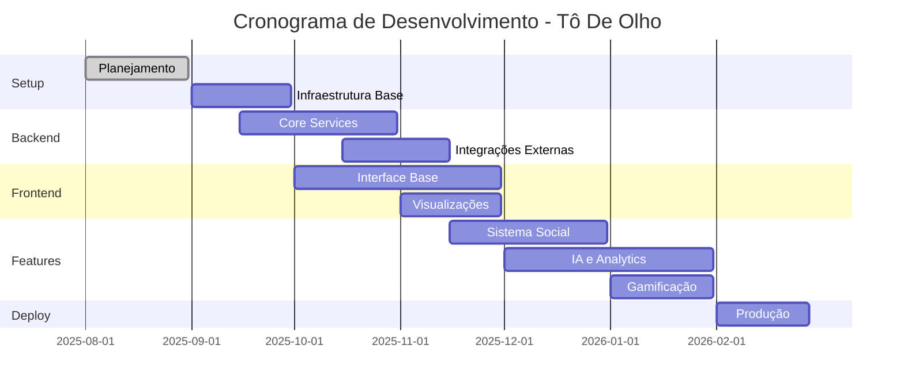

# 🛣️ Roadmap de Desenvolvimento - Projeto "Tô De Olho"

> **Plataforma de Transparência Política da Câmara dos Deputados**
> 
> **Autor**: Pedro Batista de Almeida Filho  
> **Curso**: Análise e Desenvolvimento de Sistemas - IFBA  
> **Data de Início**: Agosto/2025

## 📋 Status Geral do Projeto

| Fase | Status | Progresso | Previsão de Conclusão |
|------|--------|-----------|----------------------|
| 🏗️ **Planejamento** | ✅ Concluído | 100% | Agosto/2025 |
| 🔧 **Setup Inicial** | ✅ **CONCLUÍDO** | 100% | ✅ 13/Agosto/2025 |
| 🏛️ **Core Backend** | 🔄 Em Andamento | 50% | — |
| 🎨 **Frontend Base** | 🔄 Em Andamento | 50% | — |
| 🐳 **Docker & Deploy** | 🔄 Em Andamento | 70% | — |
| 🤖 **IA & Analytics** | ⏳ Pendente | 0% | Setembro/2025 |
| 🎮 **Gamificação** | ⏳ Pendente | 0% | Outubro/2025 |
| 🚀 **Deploy Produção** | ⏳ Pendente | 0% | Novembro/2025 |

---

## 🎯 Objetivos Principais

### 📊 Três Núcleos Fundamentais
- [x] **Acessibilidade**: Interface intuitiva para todos os usuários
- [x] **Gestão Social**: Participação cidadã nas decisões públicas  
- [x] **Ludificação**: Gamificação para elevar interesse pela gestão pública

### 🌟 Características Principais
- [x] Linguagem oficial: Português Brasileiro (pt-BR)
- [x] Dados oficiais: API da Câmara dos Deputados + TSE
- [x] Interação cidadã: Fórum e contato direto deputado-cidadão
- [x] Sistema de pontos, conquistas e rankings

---

## ✅ **STATUS ATUAL - Agosto 2025**

### 🎉 **MARCOS ALCANÇADOS (12-13/08/2025)**

#### ✅ **Infraestrutura Base - 100% Concluída**
- ✅ Estrutura completa do monorepo criada
- ✅ Docker Compose configurado (PostgreSQL 16 + Redis 7 + RabbitMQ)
- ✅ Scripts de automação (PowerShell + Makefile)
- ✅ Go modules configurado com dependências
- ✅ Package.json do frontend Next.js 15
- ✅ Prometheus + Grafana para monitoramento
- ✅ README.md atualizado com instruções
- ✅ **AMBIENTE TESTADO E FUNCIONANDO!**

#### ✅ **Backend Core - Arquitetura limpa + MVP funcional** 🔥
- ✅ Reestruturação para Clean Architecture (cmd/server + internal/{domain,application,infrastructure,interfaces})
- ✅ **API REST (Gin)** com middlewares (CORS, Recovery, Rate Limiting 100 req/min/IP)
- ✅ **Endpoints implementados**:
  - ✅ `GET /api/v1/health`
  - ✅ `GET /api/v1/deputados` (filtros UF, partido, nome)
  - ✅ `GET /api/v1/deputados/:id`
  - ✅ `GET /api/v1/deputados/:id/despesas`
- ✅ **Cliente API Câmara** resiliente (retry + backoff + rate limit local)
- ✅ **Cache Redis** read-through e **PostgreSQL** write-through (JSONB upsert)
- ✅ **Fallback de leitura** via PostgreSQL quando a API externa falhar
- ✅ **CORS** configurado para o frontend
- ✅ **Testes**: retry/backoff do client concluído; próximos: handlers/services
- ✅ Dockerfile multi-stage atualizado (binários server + ingestor)

#### ✅ **Frontend Base - MVP funcional** 🔥
- ✅ **Next.js 15** com TypeScript configurado
- ✅ **Interface moderna** - Tailwind CSS + Lucide Icons
- ✅ **Componente principal** - DeputadosPage funcional
- ✅ **Integração com backend** - Axios client configurado
- ✅ **Funcionalidades implementadas**:
  - ✅ Lista de deputados com fotos e dados
  - ✅ Sistema de filtros (UF, partido, busca por nome)
  - ✅ Modal de detalhes do deputado
  - ✅ Loading states e error handling
  - ✅ Design responsivo mobile-first
- ✅ Dockerfile presente; integração com backend local

#### ✅ **Docker & DevOps - Base pronta** 🐳
- ✅ **Docker Compose** básico (backend, frontend, Postgres, Redis)
- ✅ **Containers configurados**:
  - ✅ `todo-backend` - API Go (porta 8080)
  - ✅ `todo-frontend` - Next.js (porta 3000)
  - ✅ `todo-postgres` - PostgreSQL 16 (porta 5432)
  - ✅ `todo-redis` - Redis 7 (porta 6379)
- ✅ **Dockerfiles otimizados** - Multi-stage builds (server e ingestor)
- ✅ **Health checks** nos serviços de banco e cache
- ✅ **Scripts de automação** - make.ps1 com comandos úteis
- ✅ **Volumes persistentes** configurados

#### ✅ **Documentação Completa**
- ✅ API Reference completa criada
- ✅ Architecture Guide com Clean Architecture
- ✅ Business Rules documentadas
- ✅ CI/CD Pipeline configurado
- ✅ Testing Guide com estratégias
- ✅ TCC-PLANO-REALISTA.md para foco
- ✅ START-AGORA.md para início imediato
- ✅ docs/DOCKER.md com guia completo

### 🔄 **SITUAÇÃO ATUAL (14/08/2025)**

#### 🎉 **CONQUISTAS HOJE:**
- ✅ **Backend MVP funcional** - Endpoints de leitura integrados à API da Câmara
- ✅ **Frontend MVP funcional** - Lista de deputados com filtros e estados de UI  
- ✅ **Docker funcional** - Compose com backend, frontend, Postgres e Redis
- ✅ **Integração real** - Consumindo API da Câmara com dados reais
- ✅ **Cache Redis ativo** e **persistência PostgreSQL** (write-through) nos fluxos de leitura
- ✅ **Cliente HTTP resiliente** com retry/backoff e rate limiting local
- ✅ **Smoke tests** locais (PowerShell/Invoke-RestMethod) confirmam endpoints
- ✅ **Demo local** - Aplicação roda em ambiente de desenvolvimento
- ✅ **.gitignore completo** - Projeto organizado para versionamento

#### 🏆 **SERVIÇOS E PORTAS:**
```bash
Backend (Go)    → http://localhost:8080
Frontend (Web)  → http://localhost:3000  
PostgreSQL 16   → localhost:5432
Redis 7         → localhost:6379
```

#### 🚀 **DEMOS FUNCIONAIS:**
- ✅ **Lista deputados** - 513 deputados carregando com fotos
- ✅ **Filtros funcionando** - Por UF, partido e nome
- ✅ **Dados reais** - API da Câmara integrada
- ✅ **Interface responsiva** - Mobile + desktop
- ✅ **Performance** - Loading states e error handling

---

## 🏗️ Fases de Desenvolvimento

### **FASE 1: Setup e Infraestrutura Inicial** 📅 Agosto-Setembro/2025

#### 🔧 Configuração do Ambiente
- [x] **Setup do Repositório**
  - [x] Estrutura de monorepo
  - [ ] Configuração do Git (branches, hooks)
  - [ ] Setup do GitHub Actions (CI/CD)
  - [x] Documentação inicial

- [x] **Infraestrutura Base**
  - [x] Docker Compose para desenvolvimento
  - [x] PostgreSQL 16 setup
  - [x] Redis para cache
  - [x] RabbitMQ para mensageria

- [x] **Script de Bootstrap (Cold Start)**
  - [x] Script de inicialização automática
  - [ ] Sincronização inicial da API Câmara (513 deputados)
  - [ ] Carga priorizada: Referências → Deputados → Atividades → Histórico
  - [ ] Sistema de cache hierárquico (Redis + PostgreSQL)
  - [ ] Rate limiting e recuperação de falhas
  - [ ] Monitoramento de progresso em tempo real
  - [ ] Seed de dados demo para desenvolvimento

#### 📦 Stack Tecnológico
- [x] **Backend**: Go 1.24+ com Gin Framework
- [x] **Frontend**: Next.js 15 + TypeScript + Tailwind CSS
- [x] **Database**: PostgreSQL 16 + Redis
- [x] **Queue**: RabbitMQ
- [ ] **AI**: Google Gemini SDK + MCP
- [x] **Monitoring**: Prometheus + Grafana

---

### **FASE 2: Core Backend Services + Ingestão** 📅 Setembro-Outubro/2025

#### 🏛️ Microsserviços Principais

##### 1. **deputados-service** 
- [x] Estrutura base do serviço (Clean Architecture)
- [x] Models e domínio
- [x] Repository layer (PostgreSQL JSONB)
- [x] Business logic (use cases) + cache/fallback
- [x] HTTP handlers (REST API)
- [ ] Testes unitários (handlers/services)

##### 2. **atividades-service**
- [ ] Gestão de proposições
- [ ] Sistema de votações
- [ ] Controle de presença parlamentar
- [ ] Integração com API da Câmara

##### 3. **despesas-service**
- [ ] Análise de gastos públicos
- [ ] Cota parlamentar
- [ ] Relatórios de transparência
- [ ] Detecção de anomalias

##### 4. **usuarios-service**
- [ ] Autenticação JWT + OAuth2
- [ ] Sistema de roles (RBAC)
- [ ] Perfis de usuário
- [ ] Validação TSE para eleitores

#### 🔗 Integrações Externas
- [x] **API Câmara dos Deputados (v2)**
  - [x] Client HTTP resiliente com retry e rate limiting local
  - [x] Fallback para dados guardados (PostgreSQL/Redis)
  - [ ] Circuit breaker e métricas Prometheus
### 📥 Pipeline de Ingestão de Dados

- ✅ Binário `ingestor` com dois modos:
  - `backfill`: popular base histórica (parâmetro `-years`, padrão 5)
  - `daily`: sincronização diária incremental
- ✅ docker-compose com serviço `ingestor` one-off (executa e finaliza)
- 🔜 Persistir despesas em tabela dedicada (schema + índices)
- 🔜 Agendador (cron/k8s CronJob ou GitHub Actions) para rodar `daily`
- 🔜 Observabilidade: métricas de ingestão (sucesso/latência) e logs estruturados

- [ ] **Endpoints Prioritários da Câmara**
  - [ ] `/deputados` - Lista completa de deputados ativos
  - [ ] `/deputados/{id}/despesas` - Gastos detalhados (últimos 6 meses)
  - [ ] `/deputados/{id}/eventos` - Presença em eventos (5 dias)
  - [ ] `/proposicoes` - Proposições dos últimos 30 dias
  - [ ] `/votacoes` - Votações dos últimos 30 dias
  - [ ] `/referencias/*` - Tabelas de lookup e validação

- [ ] **API TSE** (Validação de Eleitores)
  - [ ] Verificação de CPF válido
  - [ ] Validação regional por estado
  - [ ] Sistema anti-fraude para votações
  - [ ] Cache de validações frequentes

---

### **FASE 3: Frontend e Interface** 📅 Outubro-Novembro/2025

#### 🎨 Interface Base (Design Universal)
- [ ] **Setup Next.js 15**
  - [ ] App Router configuration
  - [ ] TypeScript setup completo
  - [ ] Tailwind CSS + design system
  - [ ] Shadcn/ui components

- [ ] **Acessibilidade Universal (WCAG 2.1 AA)**
  - [ ] Navegação por teclado completa
  - [ ] Compatibilidade com leitores de tela
  - [ ] Contraste mínimo 4.5:1
  - [ ] Fonte mínima 16px
  - [ ] Zoom até 200% sem perda de funcionalidade

- [ ] **Design Mobile-First**
  - [ ] Touch targets 44px mínimo
  - [ ] Progressive enhancement
  - [ ] Interface intuitiva para todos os níveis
  - [ ] Linguagem simples sem jargões

#### 📱 Páginas Principais
- [ ] **Dashboard Principal**
  - [ ] Visão geral dos deputados
  - [ ] Métricas regionais
  - [ ] Últimas atividades

- [ ] **Perfil do Deputado**
  - [ ] Dados pessoais e mandato
  - [ ] Performance parlamentar
  - [ ] Histórico de votações
  - [ ] Análise de gastos

- [ ] **Sistema de Busca**
  - [ ] Busca inteligente
  - [ ] Filtros avançados
  - [ ] Autocomplete
  - [ ] Resultados paginados

- [ ] **Área do Usuário**
  - [ ] Login/Registro
  - [ ] Perfil personalizado
  - [ ] Deputados favoritos
  - [ ] Histórico de atividades

#### 📊 Visualizações de Dados
- [ ] **Charts e Gráficos**
  - [ ] Recharts/D3.js integration
  - [ ] Gráficos interativos
  - [ ] Mapas do Brasil (regiões)
  - [ ] Heatmaps de atividade

---

### **FASE 4: Funcionalidades Sociais** 📅 Novembro-Dezembro/2025

#### 💬 Sistema de Fórum (Instagram-Style)
- [ ] **forum-service**
  - [ ] Estrutura de tópicos e threads
  - [ ] Sistema de moderação IA + humana
  - [ ] Notificações em tempo real
  - [ ] WebSockets para chat

- [ ] **Sistema de Comentários Sociais**
  - [ ] Comentários hierárquicos (3 níveis)
  - [ ] Sistema de likes/reactions
  - [ ] Menções @username
  - [ ] Hashtags #tema
  - [ ] Notificações para respostas
  - [ ] Histórico de edições

- [ ] **Interação Deputado-Cidadão**
  - [ ] Canal direto de comunicação
  - [ ] Q&A sessions
  - [ ] Explicação de votos
  - [ ] Feedback dos eleitores
  - [ ] Stories parlamentares

#### 🗳️ Plebiscitos e Consultas
- [ ] **plebiscitos-service**
  - [ ] Sistema de votação seguro
  - [ ] Validação por região
  - [ ] Auditoria completa
  - [ ] Resultados em tempo real

- [ ] **Tipos de Consulta**
  - [ ] Plebiscitos locais
  - [ ] Consultas nacionais
  - [ ] Enquetes temáticas
  - [ ] Avaliação de deputados

---

### **FASE 5: IA e Analytics Avançados** 📅 Dezembro/2025-Janeiro/2026

#### 🤖 Integração com Gemini AI
- [ ] **ia-service**
  - [ ] SDK do Google Gemini
  - [ ] Sistema de moderação automática
  - [ ] Assistente educativo
  - [ ] Análise preditiva

#### 🛡️ Moderação Inteligente
- [ ] **Sistema Anti-Toxicidade**
  - [ ] Detecção de discurso de ódio
  - [ ] Filtro de spam
  - [ ] Classificação de sentimento
  - [ ] Sugestões de melhoria

#### 📈 Analytics e Insights
- [ ] **analytics-service**
  - [ ] Dashboard regional interativo
  - [ ] Métricas em tempo real
  - [ ] Alertas automáticos
  - [ ] Relatórios personalizados

#### 🔍 Sistema de Alertas
- [ ] **alertas-service**
  - [ ] Gastos suspeitos
  - [ ] Mudanças de posição
  - [ ] Baixa presença parlamentar
  - [ ] Novas proposições relevantes

---

### **FASE 6: Gamificação e Engajamento** 📅 Janeiro/2026

#### 🎮 Sistema de Pontos
- [ ] **Mecânicas de Ludificação**
  - [ ] Sistema de pontos por atividade
  - [ ] Badges e conquistas
  - [ ] Rankings por categoria
  - [ ] Progressão de níveis

#### 🏆 Elementos Gamificados
- [ ] **Conquistas (Badges)**
  - [ ] 🏛️ Fiscal Ativo
  - [ ] 🗳️ Eleitor Informado
  - [ ] 💬 Voz Cidadã
  - [ ] 📊 Analista
  - [ ] 🎯 Vigilante

- [ ] **Desafios e Eventos**
  - [ ] Desafios mensais
  - [ ] Quiz educativo
  - [ ] Competições regionais
  - [ ] Eventos especiais

---

### **FASE 7: Deploy e Otimização** 📅 Fevereiro/2026

#### 🚀 Infraestrutura de Produção
- [ ] **Containerização**
  - [ ] Dockerfiles otimizados
  - [ ] Docker Compose production
  - [ ] Multi-stage builds
  - [ ] Health checks

- [ ] **Kubernetes Setup**
  - [ ] Deployment manifests
  - [ ] Services e Ingress
  - [ ] ConfigMaps e Secrets
  - [ ] Horizontal Pod Autoscaler

#### 🔍 Monitoring e Observabilidade
- [ ] **Métricas e Logs**
  - [ ] Prometheus setup
  - [ ] Grafana dashboards
  - [ ] Structured logging
  - [ ] Distributed tracing

#### 🧪 Testes e Qualidade
- [ ] **Cobertura de Testes**
  - [ ] Testes unitários (>80%)
  - [ ] Testes de integração
  - [ ] Testes end-to-end
  - [ ] Performance testing

#### 🔐 Segurança
- [ ] **Security Hardening**
  - [ ] HTTPS/TLS configurado
  - [ ] Rate limiting
  - [ ] Input validation
  - [ ] Security headers
  - [ ] Vulnerability scanning

---

## 📊 Estimativas de Volume de Dados (API Câmara)

### 🏛️ Dados Principais da Câmara dos Deputados

| Tipo de Dado | Volume Estimado | Frequência | Endpoint Principal |
|--------------|-----------------|------------|-------------------|
| **Deputados Ativos** | ~513 registros | Estático | `/deputados` |
| **Proposições/Mês** | ~1.500 novas | Diária | `/proposicoes` |
| **Votações/Mês** | ~200-300 | Semanal | `/votacoes` |
| **Eventos/Semana** | ~50-100 | Diária | `/eventos` |
| **Despesas/Deputado/Mês** | ~20-50 itens | Mensal | `/deputados/{id}/despesas` |
| **Discursos/Deputado/Semana** | ~5-10 | Semanal | `/deputados/{id}/discursos` |

### ⚡ Estratégia de Cold Start

#### **Fase 1: Estrutura Base (< 1 minuto)**
- Tabelas de referência (~200 registros)
- Estados, tipos de despesa, tipos de proposição
- Cache warming inicial

#### **Fase 2: Deputados Ativos (< 5 minutos)**
- 513 deputados da legislatura atual
- Dados cadastrais + órgãos + profissões
- ~1.500 requisições total

#### **Fase 3: Dados Recentes (< 30 minutos)**
- Despesas dos últimos 6 meses (~15.000 registros)
- Proposições dos últimos 30 dias (~1.500 registros)
- Votações dos últimos 30 dias (~300 registros)
- Eventos da semana (~100 registros)

#### **Fase 4: Histórico Completo (Background - 2-4 horas)**
- Dados históricos completos dos deputados
- Tramitações de proposições
- Histórico de mandatos externos
- Total estimado: ~200.000 registros

### 🚨 Limitações da API
- **Rate Limit**: 100 requisições/minuto
- **Itens por página**: Máximo 100, padrão 15
- **Dados por ano**: Algumas consultas limitadas ao mesmo ano
- **Timeout**: Requisições podem demorar em horários de pico

---

### 🎯 KPIs Técnicos
| Métrica | Meta | Status Atual |
|---------|------|--------------|
| **Cobertura de Testes** | >80% | Inicial (cliente HTTP); ampliar para handlers |
| **Performance API** | <200ms | - |
| **Uptime** | >99.5% | - |
| **Dados Atualizados** | Daily | - |

### 👥 KPIs de Negócio (Futuro)
| Métrica | Meta | Status |
|---------|------|--------|
| **Usuários Ativos** | 1000+ | - |
| **Deputados Verificados** | 50+ | - |
| **Consultas Realizadas** | 100+ | - |
| **Engajamento Médio** | 15min/sessão | - |

---

## 🚨 Riscos e Mitigações

### ⚠️ Riscos Técnicos
| Risco | Probabilidade | Impacto | Mitigação |
|-------|---------------|---------|-----------|
| **API Câmara Indisponível** | Média | Alto | Cache extensivo + fallback |
| **Sobrecarga de Dados** | Alta | Médio | Paginação + rate limiting |
| **Performance Frontend** | Média | Médio | Code splitting + CDN |
| **Segurança** | Baixa | Alto | Security reviews + audits |

### 📅 Riscos de Cronograma
| Risco | Probabilidade | Impacto | Mitigação |
|-------|---------------|---------|-----------|
| **Complexidade IA** | Alta | Alto | MVP simplificado primeiro |
| **Integração TSE** | Média | Médio | Validação manual temporária |
| **Testes Extensivos** | Média | Médio | Testes paralelos ao desenvolvimento |

---

## 📝 Notas de Desenvolvimento

### 🚀 **Comandos Disponíveis (Atualizado 14/08/2025)**

```powershell
# === SUBIR AMBIENTE COM DOCKER ===
docker compose up -d                 # Iniciar backend, frontend, Postgres e Redis
docker compose ps                    # Status dos serviços
docker compose logs -f backend       # Logs do backend
docker compose down                  # Parar ambiente

# === DESENVOLVIMENTO LOCAL (sem Docker para app) ===
./make.ps1 dev-infra                # Sobe Postgres + Redis
./scripts/start-dev.ps1            # Abre backend (Go) e frontend (Next) em janelas separadas

# === TESTAR API DA CÂMARA ===
node .\scripts\test-api.js

# === DEBUG E MANUTENÇÃO ===
docker stats
docker exec -it todo-postgres psql -U postgres
docker exec -it todo-redis redis-cli

# === SMOKE TEST (PowerShell) ===
Invoke-RestMethod -Uri 'http://localhost:8080/api/v1/health'
Invoke-RestMethod -Uri 'http://localhost:8080/api/v1/deputados?siglaUf=SP&itens=5'
```

### 🌐 **URLs do Ambiente Local**
```
Frontend:   http://localhost:3000  (quando o container ou npm run dev estiver ativo)
Backend:    http://localhost:8080/api/v1
PostgreSQL: localhost:5432 (postgres/postgres)
Redis:      localhost:6379

Opcional (se configurados em compose separado):
Grafana:    http://localhost:3001 (admin/admin123)
Prometheus: http://localhost:9090
RabbitMQ:   http://localhost:15672 (admin/admin123)
```

### 📚 Recursos de Estudo
- [ ] API Câmara dos Deputados - Documentação completa
- [ ] Go best practices - Clean Architecture
- [ ] Next.js 15 - App Router patterns
- [ ] Google Gemini SDK - Documentation
- [ ] PostgreSQL optimization
- [ ] Kubernetes basics

### 🔧 Ferramentas de Desenvolvimento
- [x] VSCode + Go extension
- [x] Docker Desktop
- [ ] Postman/Insomnia (API testing)
- [ ] pgAdmin (PostgreSQL)
- [ ] Redis CLI
- [ ] kubectl

### 🎯 **PRÓXIMAS TAREFAS PRIORITÁRIAS (ATUALIZADO)**

#### **🚨 URGENTE - Próximas 24h (14/08/2025):**
```
1. Ingestão → Persistência de despesas (modelo + repositório + migração)
  └── Completar pipeline no `ingestor` para despesas por intervalo (ano atual + N anos)

2. Observabilidade → Métricas Prometheus e logs estruturados
  └── Expor `/metrics`, instrumentar client externo e handlers

3. Testes (ampliar)
  └── Handlers e services; medir cobertura

4. Perfis de execução
  └── Cron diário do `ingestor` (compose override/Actions) e task manual de backfill
```

#### **Semana 1 (12-18 Agosto): Código Funcionando**
```
🧱 backend/
├── 📄 main.go                 # Server Gin + rotas /api/v1
├── 📄 api_client.go           # Cliente API Câmara

🎯 frontend/
├── 📄 src/app/page.tsx        # Home page
├── 📄 src/components/         # DeputadosPage e UI
```

#### **Semana 2 (19-25 Agosto): Dados Reais**
- Integração completa API da Câmara
- Persistência PostgreSQL via pgx/pgxpool
- Caching Redis para performance
- Deploy básico (Vercel + Railway)

#### **Semana 3 (26-31 Agosto): Features Essenciais**
- Busca e filtros funcionando
- Gráficos de gastos (Recharts)
- Responsividade mobile completa
- Testes unitários básicos

---

## 📅 Cronograma Detalhado



---

## ✅ Checklist Geral

### 🏗️ Infraestrutura
- [ ] Repositório configurado
- [ ] CI/CD pipeline
- [ ] Ambiente de desenvolvimento
- [ ] Database setup
- [ ] Message queue

### 🔧 Backend Services
- [ ] deputados-service
- [ ] atividades-service  
- [ ] despesas-service
- [ ] usuarios-service
- [ ] forum-service
- [ ] plebiscitos-service
- [ ] analytics-service
- [ ] ia-service
- [ ] alertas-service

### 🎨 Frontend
- [ ] Next.js setup
- [ ] Design system
- [ ] Páginas principais
- [ ] Componentes reutilizáveis
- [ ] Charts e visualizações

### 🤖 Funcionalidades Avançadas
- [ ] IA Gemini integrada
- [ ] Sistema de moderação
- [ ] Analytics regionais
- [ ] Gamificação completa

### 🚀 Deploy
- [ ] Containerização
- [ ] Kubernetes
- [ ] Monitoring
- [ ] Segurança
- [ ] Testes de produção

---

## 🌟 Diferenciais Competitivos

### 🚀 Por que o "Tô De Olho" é Único?

#### **1. IA Conversacional Educativa**
- Assistente político pessoal com Gemini AI
- Explicação de projetos em linguagem simples
- Fact-checking automático
- Análise preditiva de votações

#### **2. Gamificação Cívica**
- RPG democrático com níveis de conhecimento
- Badges temáticas por especialização
- Missões cidadãs e desafios mensais
- Rankings regionais de participação

#### **3. Democracia Digital**
- Plebiscitos hiperlocais com validação TSE
- Simulador de impacto de leis
- Propostas colaborativas cidadão-deputado
- Orçamento participativo digital

#### **4. UX Social Media**
- Sistema de comentários estilo Instagram
- Stories parlamentares
- Live Q&A deputado-cidadão
- Feeds personalizados

### 🎯 Proposta de Valor

> **"Política como Rede Social, Educação como Jogo"**

**Não é apenas outro site de transparência. É a primeira rede social que transforma cada brasileiro em um fiscal ativo da democracia.**

---

**📧 Contato**: Pedro Batista de Almeida Filho - IFBA  
**📅 Última Atualização**: 15 de Agosto de 2025  
**🔄 Próxima Revisão**: 18 de Agosto de 2025  
**✅ Status Atual**: Backend refatorado para Clean Architecture, rate limiting ativo, fallback de leitura via Postgres, binários server/ingestor prontos. Pendente: persistir despesas plenamente, métricas Prometheus, ampliar testes/CI.

---

> 🎯 **Objetivo**: Desenvolver uma plataforma completa de transparência política que democratize o acesso aos dados da Câmara dos Deputados, promovendo maior engajamento democrático através de tecnologia, gamificação e participação social.

> 🚀 **Progresso Hoje**: 
> - ✅ Infraestrutura base 100% configurada e testada
> - ✅ Documentação completa criada (.github/docs/)
> - ✅ Monorepo estruturado  
> - ✅ Docker Compose funcional (serviços principais)
> - ✅ Scripts de automação funcionando
> - ✅ Cache Redis e persistência PostgreSQL implementados
> - 🎯 **Próximo**: Fallback de leitura, rate limiting por IP/rota, métricas e testes de handlers

> **💡 Comando para ambiente**: `docker compose up -d`  
> **🚨 Comando URGENTE**: Ver `START-AGORA.md` para fluxo de desenvolvimento local  
> **📋 Foco**: Seguir `TCC-PLANO-REALISTA.md` (MVP > Arquitetura perfeita) + pipeline de ingestão consolidado
